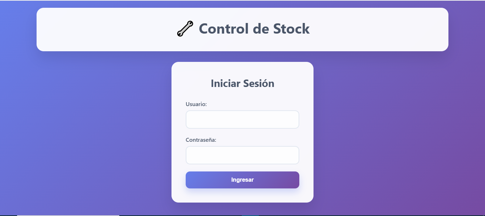
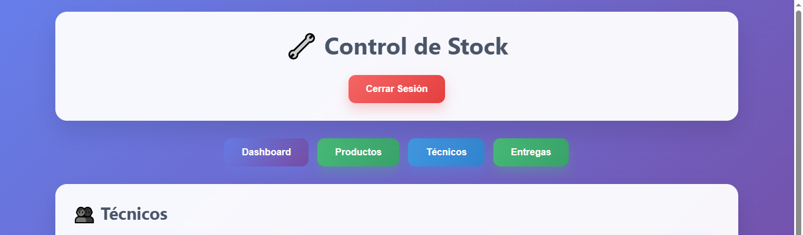
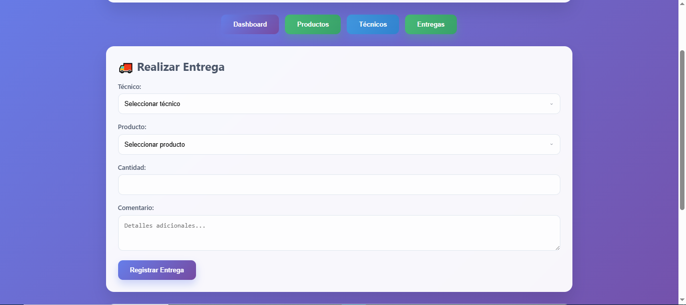

# Sistema de Control de Stock para Productos.


## 📋 Descripción

Sistema web completo para la gestión y control del inventario de transformadores, enfocado en el seguimiento de productos, control de entregas a técnicos y generación de reportes. La aplicación permite administrar el stock de forma eficiente, realizar seguimiento de los productos entregados y visualizar estadísticas por técnico.

## ✨ Características

- **Gestión de Productos**: Registro de nuevos productos con control de stock
- **Gestión de Técnicos**: Administración de personal técnico
- **Control de Entregas**: Registro de productos entregados a cada técnico
- **Dashboard Interactivo**: Panel visual con información resumida de técnicos
- **Históricos**: Registro histórico de movimientos de stock y entregas
- **Interfaz Responsiva**: Diseño adaptable para dispositivos móviles y escritorio
- **Sistema de Autenticación**: Control de acceso básico

## 🛠️ Tecnologías Utilizadas

- **Frontend**: HTML5, CSS3, JavaScript vanilla
- **Backend**: Node.js, Express.js
- **Base de Datos**: SQLite3
- **Autenticación**: Sistema básico con localStorage

## 📂 Estructura del Proyecto

```
control-stock/
├── backend/             # Código del servidor
│   ├── db/              # Directorio para la base de datos SQLite
│   ├── routes/          # Controladores y rutas de la API
│   ├── database.js      # Configuración de la base de datos
│   └── server.js        # Punto de entrada del servidor
├── css/                 # Estilos CSS
│   └── styles.css       # Archivo principal de estilos
├── js/                  # JavaScript del cliente
│   └── app.js           # Lógica de la aplicación frontend
├── index.html           # Página principal HTML
├── package.json         # Dependencias y configuración
└── README.md            # Este archivo
```

## 🚀 Instalación y Ejecución

### Prerrequisitos

- Node.js (v14 o superior)
- npm (v6 o superior)

### Pasos para instalación

1. Clona el repositorio:
   ```
   git clone https://github.com/tu-usuario/control-stock.git
   cd control-stock
   ```

2. Instala las dependencias:
   ```
   npm install
   ```

3. Inicia la aplicación:
   ```
   npm start
   ```

4. Para desarrollo con recarga automática:
   ```
   npm run dev
   ```

La aplicación estará disponible en [http://localhost:3000](http://localhost:3000)

## 📦 Estructura de la Base de Datos

La aplicación utiliza una base de datos SQLite con las siguientes tablas:

- **products**: Almacena información de los productos
  - `id`: Identificador único
  - `name`: Nombre del producto
  - `stock`: Cantidad disponible actual
  - `created_date`: Fecha de creación

- **technicians**: Registra los técnicos que pueden recibir productos
  - `id`: Identificador único
  - `name`: Nombre del técnico (único)
  - `created_date`: Fecha de registro

- **stock_entries**: Controla las entradas de stock
  - `id`: Identificador único
  - `product_id`: Referencia al producto
  - `quantity`: Cantidad ingresada
  - `entry_date`: Fecha del ingreso

- **deliveries**: Registra las entregas realizadas a los técnicos
  - `id`: Identificador único
  - `technician_id`: Técnico que recibe
  - `product_id`: Producto entregado
  - `quantity`: Cantidad entregada
  - `reason`: Campo reservado para futuros usos
  - `comment`: Observaciones sobre la entrega
  - `delivery_date`: Fecha de la entrega

## 🔗 API Endpoints

### Productos

- `GET /api/products`: Lista todos los productos con su stock actual
- `GET /api/products/entries`: Obtiene el historial de entradas de stock
- `POST /api/products`: Agrega un nuevo producto con stock inicial
- `PUT /api/products/:id`: Actualiza un producto existente
- `DELETE /api/products/:id`: Elimina un producto
- `DELETE /api/products/entry/:id`: Elimina una entrada de stock específica

### Técnicos

- `GET /api/technicians`: Lista todos los técnicos
- `GET /api/technicians/:id`: Obtiene detalles de un técnico y sus entregas
- `POST /api/technicians`: Registra un nuevo técnico
- `PUT /api/technicians/:id`: Actualiza la información de un técnico
- `DELETE /api/technicians/:id`: Elimina un técnico (si no tiene entregas asociadas)

### Entregas

- `GET /api/deliveries`: Obtiene el historial de entregas
- `POST /api/deliveries`: Registra una nueva entrega a un técnico
- `PUT /api/deliveries/:id`: Actualiza una entrega existente
- `DELETE /api/deliveries/:id`: Elimina una entrega y devuelve los productos al stock

## 🧑‍💻 Uso de la Aplicación

### Autenticación

Para acceder a la aplicación, use las siguientes credenciales:
- **Usuario**: admin
- **Contraseña**: admin123

### Flujos Principales

1. **Dashboard**: Vista general con acceso rápido a técnicos
2. **Productos**: Gestión del inventario y registro de entradas
3. **Técnicos**: Administración del personal técnico
4. **Entregas**: Registro de productos entregados a técnicos

### Funcionalidades Destacadas

- Control automático de stock al registrar entregas
- Validaciones para prevenir entregas cuando no hay suficiente stock
- Historial detallado de entregas por técnico
- Impedir eliminación de técnicos con entregas asociadas

## 🔐 Seguridad

**Nota importante**: Este proyecto utiliza un sistema de autenticación básico con credenciales codificadas y almacenamiento en localStorage. Para un entorno de producción, se recomienda implementar un sistema de autenticación más robusto con JWT, encriptación de contraseñas y HTTPS.

## 📸 Capturas de Pantalla

<div align="center">
  <h3>Inicio de Sesión</h3>
  
  
  <h3>Panel Principal (Dashboard)</h3>
  
  
  <h3>Registro de Entregas</h3>
  
</div>

## 📄 Licencia

Este proyecto está licenciado bajo la Licencia MIT - ver el archivo [LICENSE](LICENSE) para más detalles.

## 👨‍💻 Autor

Desarrollado por [Tu Nombre]

---

⭐️ Si encuentras útil este proyecto, ¡no dudes en darle una estrella en GitHub! ⭐️
